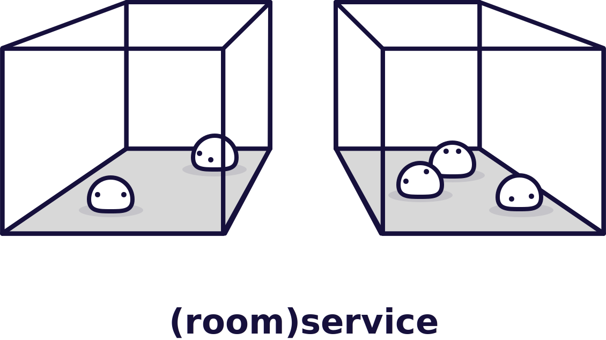

  

# @roomservice/browser

Room Service is the easiest way to add real-time collaboration to your app. Room Service is a real-time service with a built-in [CRDT](https://en.wikipedia.org/wiki/Conflict-free_replicated_data_type) that automatically merges multiple people's state together without a whole lot of hassle. To learn more, see [roomservice.dev](https://www.roomservice.dev). 

This is the official, javascript SDK. 

- [Documentation](https://docs.roomservice.dev/)
- [Website](https://www.roomservice.dev/)
